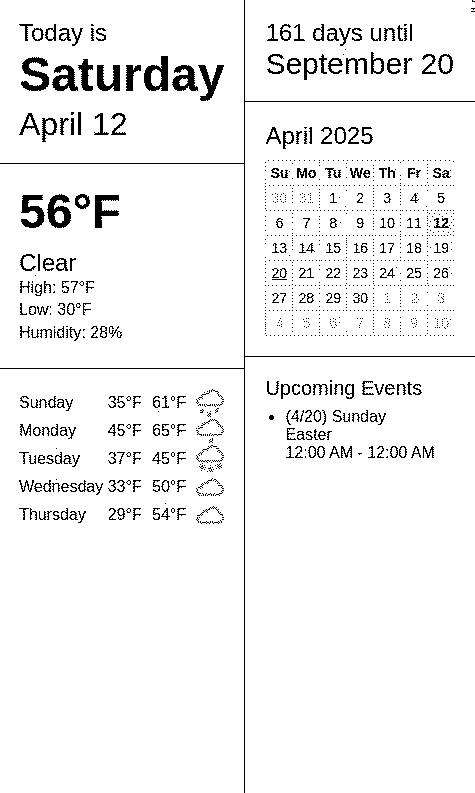

# Terminus Publisher  

Terminus Publisher is a Node.js application designed to generate and publish a dynamic e-paper dashboard. It integrates weather forecasts, calendar events, and countdowns into a visually appealing HTML dashboard, which is then pushed to a specified endpoint for display.  
Terminus refers to the open source [boys_hanami](https://github.com/usetrmnl/byos_hanami) project, officially supported by [TRMNL](https://use-trmnl.com) for e-paper displays. 
  

## Features  

- **Weather Forecast**: Fetches current and 5-day weather forecasts using the Open-Meteo API.  
- **Calendar Integration**: Displays upcoming events from a private iCal URL.  
- **Countdown Timer**: Shows a countdown to a target date.  
- **Dynamic HTML Dashboard**: Generates a responsive dashboard with weather, calendar, and countdown information.  

## Prerequisites  

- Node.js (v16 or higher)  
- Docker (optional, for containerized deployment)  
- Access to the following APIs:  
    - Open-Meteo API for weather data  
    - iCal URL for calendar events  

## Installation  

1. Clone the repository:  
     ```bash  
     git clone https://github.com/clarson15/terminus-publisher.git  
     cd terminus-publisher  
     ```  

2. Install dependencies:  
     ```bash  
     npm install  
     ```  

3. Create a `.env` file based on `.env.example` and fill in the required values:  
     ```bash  
     cp .env.example .env  
     ```  

## Usage  

### Local Development  

1. Start the server:  
     ```bash  
     npm start  
     ```  

2. The application will fetch weather and calendar data, generate the dashboard, and publish it to the specified endpoint.  

### Docker Deployment  

1. Build and push the Docker image:  
     ```bash  
     docker build -t terminus-publisher:latest .
     docker run --rm --name terminus-publisher terminus-publisher:latest
     ```  

## License  

This project is licensed under the MIT License.  